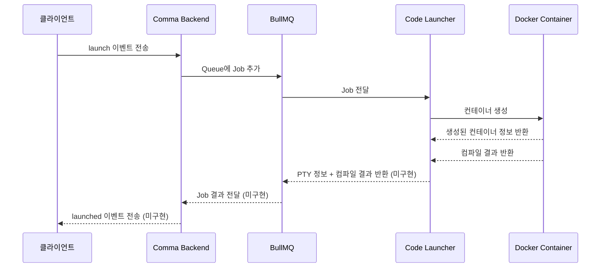

# COMMA 프로젝트

## 개요

COMMA는 Programiz와 유사한 **웹 기반 온라인 코드 실행 플랫폼**이다.
파일/프로젝트 단위 관리 없이, 사용자가 코드를 입력하면 즉시 실행하는 방식이다.
코드 실행은 Docker 컨테이너로 격리되며, 클라이언트는 `node-pty`를 통한 **PTY 연결**로 해당 컨테이너에 직접 붙는다.

---

## 시스템 구성

두 개의 독립적인 NestJS 애플리케이션으로 구성된다.

### 1. Comma Backend (별도 프로젝트)
- 클라이언트로부터 WebSocket으로 코드 실행 요청 수신
- 요청 데이터를 BullMQ Queue에 Job으로 추가하여 Code Launcher로 전달
- Code Launcher로부터 결과를 받아 클라이언트에 반환
- 추후 로그인/회원가입 등 유저 기능 구현 담당

### 2. Code Launcher Application ← 현재 프로젝트
- BullMQ를 통해 Job을 전달받아 코드 컴파일/실행 담당
- 언어별 Docker 이미지로 컨테이너 생성
- 컨테이너 접속을 위한 PTY 정보 및 컴파일 결과 반환

### Redis
- 클라이언트 세션 관리 및 BullMQ 메시지 큐 백엔드로 활용
- 인메모리 기반으로 빠른 처리 및 다중 서버 간 세션 공유 가능
- BullMQ는 별도 브로커 없이 외부 Redis를 그대로 활용하는 Node.js 라이브러리

---

## 전체 실행 흐름



1. `클라이언트`가 '코드 실행' 버튼 클릭 시 `Comma Backend` 앱에 요청 전달
   - 전달 데이터: 클라이언트 소켓 ID, 프로그래밍 언어, 코드
2. `Backend` 앱이 BullMQ Queue에 `launch` Job으로 추가하여 `Code Launcher`로 전달
3. `Code Launcher`가 Job을 수신하여 언어별 Docker 컨테이너 생성 및 코드 실행
4. 실행 결과(PTY 정보, 컴파일 성공 여부)를 BullMQ를 통해 `Backend`로 반환
5. `Backend`가 결과를 `클라이언트`로 전달
6. `클라이언트`는 PTY 정보를 이용해 Docker 컨테이너에 직접 PTY 연결

---

## 기술 스택

- **프레임워크:** NestJS
- **메시지 큐:** BullMQ (Redis 기반)
- **컨테이너:** Docker (dockerode)
- **터미널 연결:** node-pty (PTY) - 미구현
- **데이터베이스:** Redis (BullMQ 백엔드)

---

## 주요 동작

### BullMQ Job 데이터 구조

BullMQ로부터 수신하는 Job의 데이터:

```typescript
interface CodeLaunchRequestJob {
    clientSocketId: string;  // 클라이언트 소켓 ID
    code: string;            // 실행할 코드
    codeLanguage: string;    // 프로그래밍 언어
}
```

### Docker 컨테이너 생성

- 언어별 Docker 이미지 매핑 상수를 통해 이미지 결정
- 로컬에 이미지가 없으면 자동 pull
- TTY 활성화 및 컨테이너 종료 시 자동 삭제(AutoRemove) 설정
- 기본 컨테이너 타임아웃: **120초** (2분)
- 기본 fallback 이미지: `ubuntu:22.04`

### 지원 언어 및 Docker 이미지

| 언어 | Docker 이미지 |
|------|--------------|
| javascript | `node:20-slim` |

---

## 미구현 사항

- PTY 정보를 BullMQ를 통해 Comma Backend로 반환하는 로직
- 코드 컴파일/실행 결과 반환
- 컨테이너 내 코드 주입 (현재 `code` 파라미터 미사용)
- 추가 언어 지원 (현재 JavaScript만 지원)
